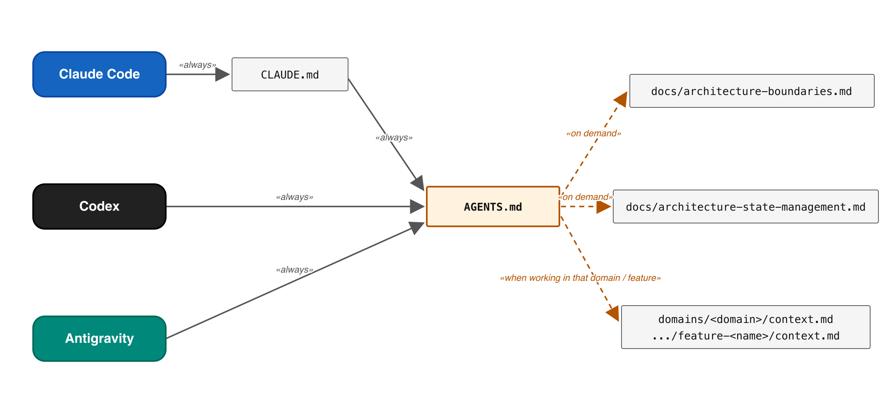
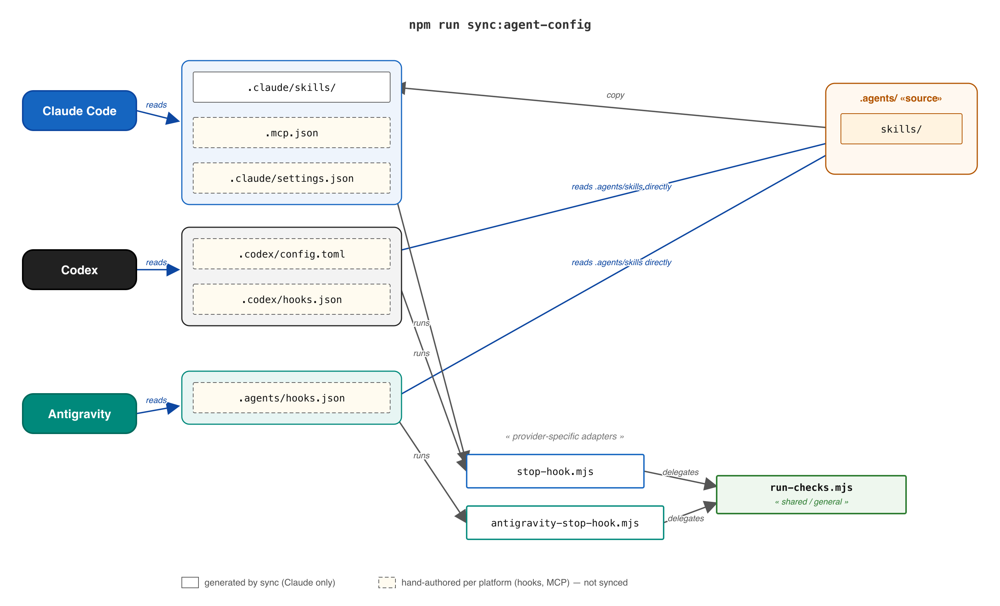
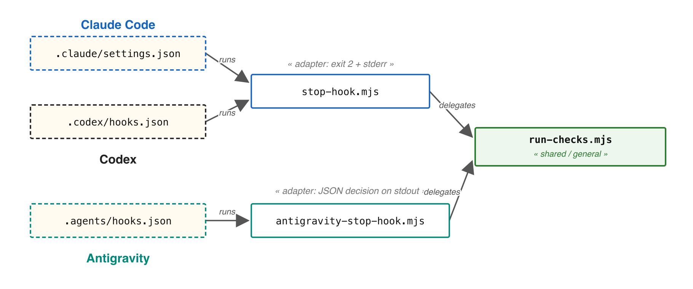

# AI Setup

How coding agents are configured in this repository. Supported agents: Claude
Code, OpenAI Codex and Google Antigravity.

## Instructions

`AGENTS.md` is the single instruction file. Claude Code reads it through
`CLAUDE.md` (which only contains `@AGENTS.md`); Codex and Antigravity read it
directly. `AGENTS.md` points to the architecture rules in `docs/` and to the
per-domain and per-feature `context.md` files (see `docs/context-files.md`),
which are loaded on demand.

## Skills

- Source of truth: `.agents/skills/`. Codex and Antigravity read this folder
  natively.
- Claude Code expects `.claude/skills/`, so `npm run sync:agent-config`
  mirrors the folder there. The sync runs on `npm install` and in the
  pre-commit hook whenever `.agents/skills/` changed. Never edit
  `.claude/skills/`.
- `angular-developer` and `angular-new-app` come from `angular/skills`
  (tracked in `skills-lock.json`); the others are project skills:
  `architecture-review`, `code-quality-review`, `domain-boundaries-review`,
  `forensic-architecture-review`, `verify-and-fix`, `refine-ticket`.

## Hooks

A stop hook runs the fast checks (`scripts/run-checks.mjs`: lint incl.
Sheriff, ArchUnitTS architecture tests, script tests) and keeps the agent
working until they pass. The logic is shared; only the adapter differs:

| Agent       | Configuration           | Adapter                                   |
| ----------- | ----------------------- | ----------------------------------------- |
| Claude Code | `.claude/settings.json` | `scripts/hooks/stop-hook.mjs`             |
| Codex       | `.codex/hooks.json`     | `scripts/hooks/stop-hook.mjs`             |
| Antigravity | `.agents/hooks.json`    | `scripts/hooks/antigravity-stop-hook.mjs` |

Claude Code and Codex share one protocol (exit code 2, stderr becomes the
feedback). Antigravity expects `{ "decision": "continue", "reason": ... }` on
stdout. Hooks are hand-maintained per tool and not synced.

The full checks (plus browser unit tests and production build) run with
`npm run verify`; the `verify-and-fix` skill drives that loop.

## MCP servers

MCP servers are configured per tool and not synced:

| Agent       | Configuration                    |
| ----------- | -------------------------------- |
| Claude Code | `.mcp.json`                      |
| Codex       | `.codex/config.toml`             |
| Antigravity | MCP settings of the IDE (global) |

Both files register `angular-cli` (`npx -y @angular/cli mcp`) and `detective`
(`http://localhost:3334/mcp`; start it with `npx @softarc/detective` before a
review).

## Architecture tests

`arch/` contains ArchUnitTS rules for the suffix-based access rules
(`npm run test:arch`). The analysed project is `tsconfig.arch.json`, which
inherits the root config and only narrows the scope to `src/` without specs.
A rule whose pattern matches no file fails instead of passing silently.

## Tickets and AFK runs

Work items live in `tickets/` (format and rules in `docs/tickets.md`):

1. Write a ticket with `status: draft`.
2. The `refine-ticket` skill checks it against the code, asks the open
   questions with answer options and records the answers under
   `## Decisions`; the ticket becomes `ready`.
3. `npm run sandcastle` implements every `ready` ticket AFK with
   [Sandcastle](https://github.com/mattpocock/sandcastle): one Claude Code run
   per ticket, in its own git worktree on the branch `ticket/<slug>`. The run
   starts from the last commit, so commit the ticket first. Implementing a
   ticket interactively works the same way; only the AFK parts below differ.
4. Review the branch:
   - The run stopped with `## Open questions` (`status: draft` again): settle
     them with `refine-ticket` and start the run again with `--rerun`.
   - Otherwise go through `## Assumptions` with `refine-ticket`: confirmed
     entries move to `## Decisions`, rejected ones need a change on the branch.
5. Merge, and set `status: done` if the agent has not done so already.

The run is not sandboxed: Sandcastle's container sandbox is not used
(`noSandbox()`) and Claude Code's OS sandbox is off. The agent runs directly
on the host with `bypassPermissions`, so it never waits for approval and has
the same file and network access as your user. Claude Code's OS sandbox is
not an option here because it keeps Chromium from starting, so the browser
tests of `npm run verify` cannot pass inside it. Only start runs for tickets
you trust.

Options: `--ticket <file>` (one ticket regardless of status), `--model <id>`
(or `SANDCASTLE_MODEL`), `--rerun` (ignore an existing branch).
Requirements: Claude Code CLI logged in.
